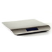

WebScale
========

Measure weight using a Stamps.com digital USB postage scale.



## Hardware
*I successfully performed these steps in [September 2014](https://twitter.com/Aldaviva/status/516771809962651648). Today, it may work differently, or not at all.*

1. Sign up for free trial at [Stamps.com](https://registration.stamps.com/registration/).
2. During signup, request a complimentary [5-pound digital postage scale](https://store.stamps.com/collections/hardware/products/5lb-scale). Pay $9.99 USD shipping and handling.
3. Before the four-week trial is up, [cancel your account](https://www.stamps.com/postage-online/faqs/) and avoid the monthly fee.

## Installation
[This package is available on npm.](https://www.npmjs.com/package/webscale)
```sh
$ npm install webscale
```
In the event of installation trouble, refer to the [node-hid documentation](https://github.com/node-hid/node-hid/blob/master/README.md).

## Usage
```javascript
const WebScale = require('webscale');
const webScale = new WebScale();

webScale.on('change:weight', ounces => {
    console.log(`${ounces} oz.`);
});
```
See also [`test-client.js`](https://github.com/Aldaviva/webscale/blob/master/test-client.js).

## Events

### change:weight
Called whenever the scale's weight reading changes.
#### Arguments
- **ounces** how much weight is on the scale, in ounces. Floating-point number with precision of one digit after the decimal place (tenths of ounces). Can be negative if the scale was tared with weight on it.

### connected
Called when the program first starts and connects successfully to the device, or when it reconnects after losing the connection.

### disconnected
Called when the device is unplugged or powered off, and once per reconnect attempt.

### error
An error with the USB device occurred (except disconnections, see above).
#### Arguments
- **error** The error from node-hid.

## Methods

### tare()
Reset the scale so the current weight will be read as zero. The scale will also automatically tare itself each time it powers on.

### disconnect()
Disconnect from the USB device.

## See Also
- **[Aldaviva/WebScale.net](https://github.com/Aldaviva/WebScale.net)** - this library ported from Node.js to .NET